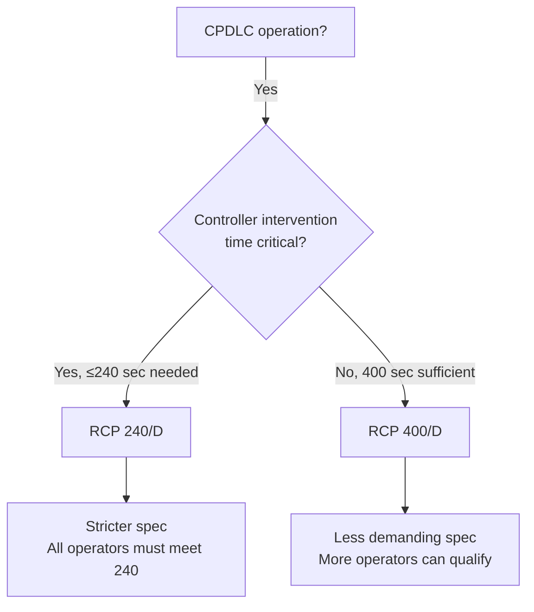

# RCP 400 D

> [!summary] TL;DR
> RCP 400/D is the data-link RCP specification for routine communication where 400-second transaction time is sufficient. Less demanding than RCP 240/D — used for non-urgent operations where longer transaction time is acceptable.

---

## Where RCP 400/D applies

| Factor | Points toward RCP 400/D over RCP 240/D |
|---|---|
| **Separation standard** | ≥ 10 min longitudinal — less frequent controller intervention needed |
| **Transaction urgency** | Routine communication: position reports, clearances with long lead time |
| **Airspace density** | Low traffic — oceanic, remote, polar |
| **Operator capability** | Aircraft/crew/service-provider combination cannot consistently meet 240 sec |

> [!note] When 400/D is sufficient
> If the ATM safety assessment determines that a controller has 400 seconds to intervene without compromising separation, RCP 400/D is the appropriate specification. This is common in low-density oceanic airspace where 10+ minute separation standards apply.

---

## Component allocation breakdown

The total 400-second CTT budget is split across four components. Realistic allocations:

| Component | Typical allocation | What it covers | Verified by |
|---|---|---|---|
| **ANSP (ATS ground system)** | ~30 sec | Processing time from message arrival at ATS unit to delivery to controller | ATS system specifications, ground testing |
| **CSP (air-ground data link)** | ~280 sec | Satellite transmission: aircraft → satellite → ground earth station → network | CSP service agreement, link budget analysis |
| **Aircraft system** | ~60 sec | FMS processing, CPDLC message composition, transmission queuing | Aircraft type certificate, avionics compliance data |
| **Aircraft operator** | ~30 sec | Crew procedures: reading, composing, confirming CPDLC messages | Training records, procedure validation, crew proficiency checks |

**Total: 400 seconds**

> [!tip] The CSP dominates
> In satellite-based data-link, the air-ground transmission typically consumes 60-70% of the budget. This is why CSP selection and link performance matter so much for RCP compliance.

---

## How each allocation is verified

### ANSP allocation (~30 sec)

| Evidence type | What it proves |
|---|---|
| ATS system specifications | Maximum processing time from message ingestion to controller display |
| Ground integration test results | End-to-end timing from network handoff to controller workstation |
| System performance monitoring | Ongoing measurement of actual processing times |

### CSP allocation (~280 sec)

| Evidence type | What it proves |
|---|---|
| Link budget analysis | Calculated transmission time for the satellite constellation and aircraft location |
| CSP service agreement | Contracted performance levels with committed latency |
| Historical link performance data | Actual measured transmission times for the target airspace |
| Outage notification process | How CSP reports degradation to operator/ANSP |

### Aircraft system allocation (~60 sec)

| Evidence type | What it proves |
|---|---|
| Type certificate / STC | Aircraft system certified for CPDLC FANS 1/A operations |
| Avionics compliance statement | Per RTCA DO-306 or equivalent — processing time specifications |
| Interoperability test results | Aircraft system tested with target ground network |
| Self-test / BITE data | Built-in test equipment log showing nominal processing |

### Aircraft operator allocation (~30 sec)

| Evidence type | What it proves |
|---|---|
| Training records | Crew trained on CPDLC message composition and confirmation |
| Procedure validation | Standard operating procedures include CPDLC response time expectations |
| ORT results | Operational readiness trial measuring actual crew response times |
| Crew proficiency records | Recurrent training and check data |

---

## Common failure modes

| Component | Failure mode | Impact | Detection |
|---|---|---|---|
| ANSP | ATS system overload (peak traffic) | Processing time spikes → exceeds allocation | ATS system monitoring |
| CSP | Satellite handover delay (aircraft crosses beam boundary) | Temporary link disruption → transaction delayed | Link continuity logs |
| CSP | Ground earth station congestion | Queuing delay at ground segment | CSP performance reports |
| Aircraft | FMS message queue full | CPDLC message held until queue clears | FMS log, pilot report |
| Operator | Crew delayed response (high workload) | Transaction time exceeds operator allocation | ACP monitoring, crew report |

---

## Monitoring fields (from Appendix D)

For RCP 400/D, the monitoring programme collects:

| Field | What it measures | Source |
|---|---|---|
| **Transaction time** | End-to-end time for each CPDLC transaction | Appendix D Table D-1 |
| **Continuity** | Percentage of transactions completing without interruption | Appendix D Table D-2 |
| **Availability** | CSP service uptime percentage | Appendix D Table D-3 |
| **Problem reports** | Count and category of reported issues | Appendix D Table D-4 |

> See [[Post-Implementation Monitoring]] and [[CPDLC and ADS-C Monitoring]] for the full monitoring framework.

---

## RCP 400/D vs 240/D — when to choose which

---

## Source basis

- Doc 9869 Appendix B, RCP 400/D specification table
- For detailed source routing: [[Appendix B RCP Table Verification]]
- For the allocation framework: [[RCP Allocation]]

---

## Related notes

- [[Required Communication Performance]]
- [[Communication Transaction Time]]
- [[RCP Compliance]]
- [[RCP Monitoring]]
- [[RCP Failure and Degradation]]
- [[Choosing Your RCP-RSP Specification]] — decision tree
- [[PBCS Responsibility Matrix]]
