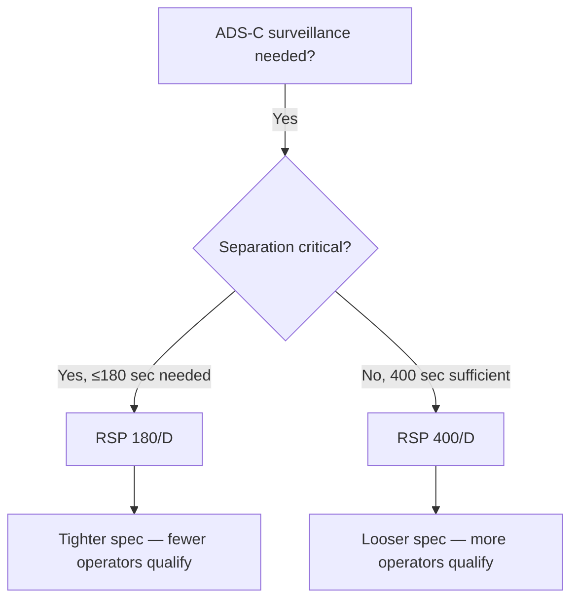

# RSP 400 D

> [!summary] TL;DR
> RSP 400/D is the data-link RSP specification for surveillance where 400-second data delivery time is sufficient. Less demanding than RSP 180/D — used for non-urgent surveillance where longer delivery times are acceptable.

---

## Where RSP 400/D applies

| Factor | Points toward RSP 400/D over RSP 180/D |
|---|---|
| **Separation standard** | ≥ 10 min longitudinal — less frequent position updates needed |
| **Surveillance urgency** | Routine position monitoring, not separation-critical |
| **Airspace density** | Low traffic — oceanic, remote |
| **ADS-C contract type** | Periodic reporting with longer intervals |
| **Operator capability** | Aircraft/provider cannot consistently meet 180 sec SDDT |

---

## Component allocation breakdown

| Component | Typical allocation | What it covers | Verified by |
|---|---|---|---|
| **ANSP (ATS ground system)** | ~30 sec | Processing ADS-C report from ground network handoff to controller display | ATS system specifications |
| **CSP (air-ground data link)** | ~280 sec | Satellite transmission of ADS-C report: aircraft → satellite → ground | CSP service agreement, link analysis |
| **Aircraft system** | ~60 sec | Position measurement, report generation, FMS processing, queuing | Avionics compliance data |
| **Aircraft operator** | ~30 sec | Crew monitoring of ADS-C contract compliance | Training records, procedure validation |

**Total: 400 seconds**

---

## How each allocation is verified

### ANSP allocation (~30 sec)

| Evidence type | What it proves |
|---|---|
| ATS system specifications | Processing time from report arrival to display |
| Ground integration testing | End-to-end measurement |
| System monitoring | Ongoing processing time tracking |

### CSP allocation (~280 sec)

| Evidence type | What it proves |
|---|---|
| Link budget analysis | Calculated transmission time |
| CSP service agreement | Contracted performance and latency |
| Historical link data | Actual measured transmission times |
| Outage notification process | Degradation reporting |

### Aircraft system allocation (~60 sec)

| Evidence type | What it proves |
|---|---|
| Type certificate / STC | ADS-C capability certification |
| Avionics compliance | Per RTCA standards — measurement and processing specifications |
| Interoperability test results | Aircraft-ground network testing |
| BITE data | Self-test showing nominal operation |

### Aircraft operator allocation (~30 sec)

| Evidence type | What it proves |
|---|---|
| Training records | Crew trained on ADS-C operations |
| Procedure documentation | ADS-C contract management procedures |
| ORT results | Trial period measuring compliance |
| Recurrent training records | Ongoing proficiency |

---

## Common failure modes

| Component | Failure mode | Impact | Detection |
|---|---|---|---|
| ANSP | ATS system delayed processing | Report arrives but not displayed | System monitoring |
| CSP | Satellite beam handover during ADS-C report | Report transmission delayed or lost | Link continuity data |
| Aircraft | ADS-C contract terminated prematurely | No reports generated | FMS log, ground system alert |
| Operator | Crew unaware of contract requirements | Contract not re-established after termination | Ground monitoring |

---

## Monitoring fields (from Appendix D)

| Field | What it measures | Source |
|---|---|---|
| **Data delivery time** | End-to-end for each ADS-C report | Appendix D Table D-1 |
| **Continuity** | Percentage of reports delivered without issue | Appendix D Table D-2 |
| **Availability** | CSP/SSP service uptime | Appendix D Table D-3 |
| **Problem reports** | Reported surveillance issues | Appendix D Table D-4 |

---

## RSP 400/D vs 180/D — selection

---

## Source basis

- Doc 9869 Appendix C, RSP 400/D specification table
- For detailed source routing: [[Appendix C RSP Table Verification]]
- For the allocation framework: [[RSP Allocation]]

---

## Related notes

- [[Required Surveillance Performance]]
- [[Surveillance Data Delivery Time]]
- [[RSP Compliance]]
- [[RSP Monitoring]]
- [[Choosing Your RCP-RSP Specification]]
